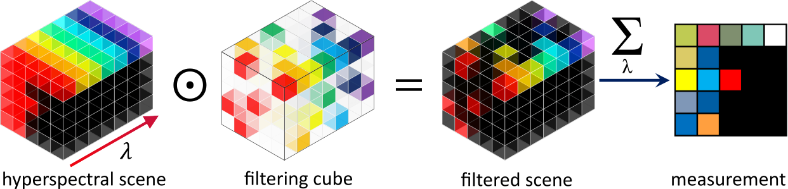

# Summary

The image formation in coded-aperture spectral snapshot imagers (CASSI) is key information to process the acquired compressed data, and the optical system design and calibration of these instruments require great care.  
`SIMCA` is a Python-based tool built upon ray-tracing equations of each optical component to produce realist measurements of various CASSI systems.
The underlying model takes into account spatial filtering, spectral dispersion, optical distortions, PSF, sampling effects, and optical misalignments.

# Statement of need
{width="70%"}

Spectral imaging has been considerably renewed by the advent of CASSI systems ("Coded-aperture Spectral Snapshot Imager") [@Wagadarikar2008]). 
These computational imaging systems reduce the number of acquisitions required to interpret high-dimensional hyperspectral scenes, remove the need for mechanical scanning, and allow for exploration of optimal processing for a given task (classification, unmixing, target detection, reconstruction, etc.) 

In order to interpret these multiplexed measurements, various algorithms have been proposed, mainly focusing on classification [@Zhang2021][@DunlopGray2016][@Biquard2022] and reconstruction [@BioucasDias2007] [@Yuan2016] [@Miao2019] [@Chan2016] [@Ardi2018] of the observed scene.
All these algorithms rely on a precise knowledge of the spatial and spectral information contained in the compressed measurements, which is directly related to the optical system characteristics and calibration.
However, the image formation process of a CASSI system is complex, and the calibration of these instruments is a tedious process.

A ray-tracing based parametric propagation model, associated to interpolation methods whose relevance was underlined in [@Arguello2013], is used to simulate the image formation process in CASSI systems.
Our tool allows for a comparison of various system architectures, optical components, and coded-aperture patterns.
In addition, this same model can be used to calibrate a real instrument, build a virtual prototype for testing and training, and explore the processing of the compressed measurements for a given task.

Our contribution is motivated by the lack of tools to precisely simulate CASSI systems acquisitions and the lack of knowledge of the optical characteristics and the coded aperture needed to interpret a hyperspectral scene.

# Brief software description

`SIMCA` is a simulation tool to generate realistic Coded-Aperture Spectral Snapshot Imagers measurements.
The repository contains an application programming interface (API) and a graphical user interface (GUI) built in PyQt5 to analyze hyperspectral scenes and interact easily with the API.

Tutorials for using the API and GUI are available [here](https://a-rouxel.github.io/simca/).

## Optical model
The core of the code is a ray-tracing model of the optical system allowing for precise simulation of light propagation depending on the characteristics and types of optical components.
It includes various physical effects that are often neglected in the literature, such as optical distortions, optical misalignments, etc.

Available propagation models are:

- **Higher-Order** from [@Arguello2013]
- **Ray-tracing** (first implementation in [@Hemsley2020])

Available system architectures are:

- Single-Disperser CASSI
- Double-Disperser CASSI

Available optical components and related caracteristics are:

- Lens (params: focal length)
- Prism (params : apex angle, glass type, orientation misalignments)
- Grating (params : groove density, orientation misalignments)

## Coded-Aperture generation

The generation of coded-apertures is a key step in the design of CASSI systems.
We provide a sample of coded-aperture generation methods, including:

- Random with various ratios of open/closed coded aperture pixels
- Two types of blue-noise random patterns
- LN-Random [@Hemsley2022][@Hemsley2020a] patterns

None of these methods require prior-knowledge of the scene.

## Coded image formation
  
We provide a way of harnessing these optics-related parameters to generate realistic measurements of the scene corresponding to coded images as recorded by the detector.
Depending on the system architecture, the coded image formation varies.
However for each case, it requires multiple projections of the coded-aperture pattern onto the detector after propagation through the optical system, each projection corresponding to a specific wavelength within the spectral range of the scene under study.

Interpolation between these multiple (none-structured) projections and the (structured) detector pixels grid is performed, then all these projections are summed to obtain the coded image.

# Acknowledgements

We acknowledge multiple discussions, testing and fruitful comments from Maud Biquard, Hervé Carfantan, Valentin Portmann, Trung Tin Dinh

# References
